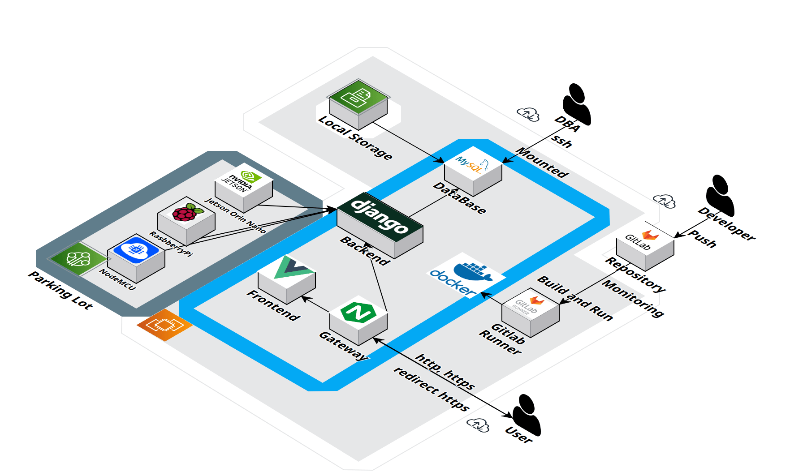
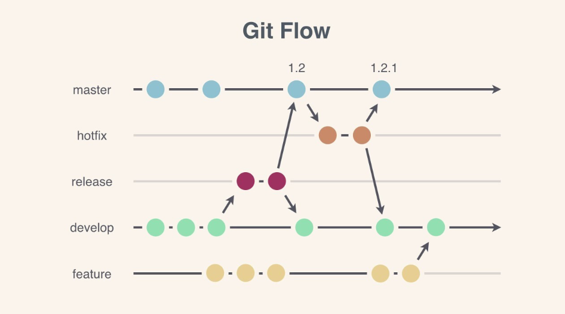
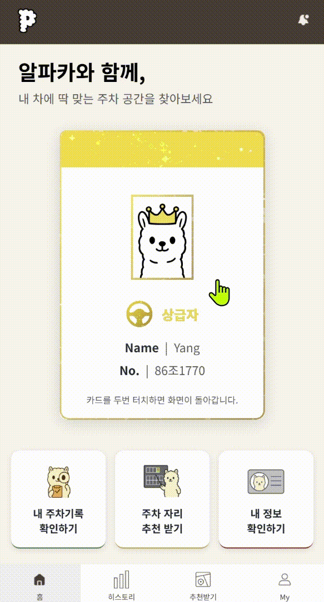
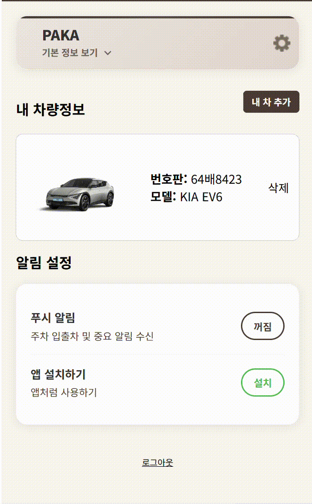
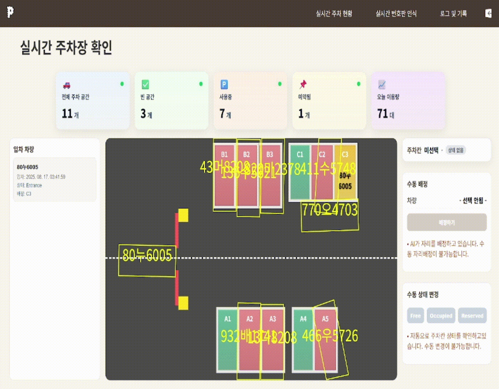

# 🦙 알파카(Alpacar)

> **2025.07.14 ~ 2025.08.19 (6주)**

<p align="center">
  
</p>
<!-- <p align="center">
  
  
  
</p> -->
---

## 📌 프로젝트 소개

> **Alpacar** 는 사용자의 차량 크기와 주차 실력을 고려해  
> 최적의 주차 공간을 자동 추천하는 **스마트 주차 관리 시스템**입니다.

---

## 👥 팀원 소개

<!-- 깃허브 등 본인의 링크 추가해주세요 -->

| 이름                                    | 역할                     |
| --------------------------------------- | ------------------------ |
| [김민규](https://github.com/Me-in-U)    | Backend ⚙️ & Embedded 🔌 |
| [이재훈]()                              | AI 🤖 & Infra ☁️         |
| [이유니]()                              | Embedded 🔌              |
| [김가현]()                              | Embedded 🔌              |
| [백종석](https://github.com/baekjs0123) | PM 📋 & Frontend 🎨      |
| [양정은]()                              | Frontend 🎨              |

---

## 🌟 주요 기능

1. 🔍 번호판 **객체탐지 & OCR 인식**
2. 🚘 차량 모델 **자동 조회**
3. 🅿️ **최적 주차 구역 자동 추천**
4. 📱 **웹 앱(PWA) 기반 사용자 안내**
5. 💡 디스플레이에 **차량번호 출력**
6. 🧑‍✈️ 운전자 **주차 능력 반영**
7. 🖥 관리자 **실시간 모니터링**
8. 🔔 차량 이벤트 발생시 사용자 **푸시 알림 전송**

---

## ⚙️ 기술 스택

| 구분                | 기술                                                                                                                                                                                                                                                                                                                                                                                                                                                                                                                                                                                                                                                                                                                                                                                                                                                                                                                                                                                                                                                                                                                                                                                                                                                                                                            |
| ------------------- | --------------------------------------------------------------------------------------------------------------------------------------------------------------------------------------------------------------------------------------------------------------------------------------------------------------------------------------------------------------------------------------------------------------------------------------------------------------------------------------------------------------------------------------------------------------------------------------------------------------------------------------------------------------------------------------------------------------------------------------------------------------------------------------------------------------------------------------------------------------------------------------------------------------------------------------------------------------------------------------------------------------------------------------------------------------------------------------------------------------------------------------------------------------------------------------------------------------------------------------------------------------------------------------------------------------- |
| **🖥 Backend**       |            |
| **🎨 Frontend**     |                                                                                                                                                                                                                                                                                                                                                                                                                                                                                                              |
| **📡 IoT**          |                                                                                                                                                                                                                                                                                                                                                                                                                                                                                                                                                                                                                            |
| **🍓 Raspberry Pi** |       -3776AB?style=for-the-badge&logo=python&logoColor=white>)                                                                                                                                                                                                                                              |
| **⚙️ DevOps**       |                                                                                                                                                                                                                                                                                                                                                                                                                                                                                                                                                                                                                                                                                                                                                                                                                                                              |
| **🤝Collaboration** | -FCA121?style=for-the-badge&logo=Gitlab&logoColor=white>)                                                                                                                                                                                                                                                                                                                                                                                                                                                                                                                                                                                                                                                                                                                                                                        |

---

## 📂 프로젝트 폴더 구조

### Arduino

<details>
  <summary>펼쳐보기</summary>

```plantext
Arduino/
├── get_ocr_kor_ws/
│   ├── get_ocr_kor_ws_update_0812.ino
│   └── get_ocr_kor_ws.ino
└── individual_lcd/
    └── individual_lcd.ino
```

</details>

### Backend

<details>
  <summary>펼쳐보기</summary>

```plantext
backend/
└── djangoApp/
    ├── djangoApp/
    │   ├── __init__.py
    │   ├── asgi.py
    │   ├── settings.py
    │   ├── urls.py
    │   └── wsgi.py
    ├── accounts/
    ├── Database/
    ├── events/
    ├── jetson/
    ├── parking/
    ├── staticfiles/
    ├── streamapp/
    ├── vehicles/
    ├── venv/
    ├── check_mappings.py
    ├── debug_encoding.py
    ├── Dockerfile
    ├── insert_data.py
    ├── manage.py
    ├── readme.md
    └── requirements.txt
```

</details>

### Frontend

<details>
  <summary>펼쳐보기</summary>

```plantext
frontend/
└── alpacar-vue/
    ├── public/
    ├── src/
    │   ├── api/
    │   ├── assets/
    │   ├── components/
    │   ├── composables/
    │   ├── data/
    │   ├── router/
    │   ├── stores/
    │   ├── types/
    │   ├── utils/
    │   ├── views/
    │   ├── App.vue
    │   └── main.ts
    ├── .vscode/
    ├── dev-dist/
    ├── node_modules/
    ├── .gitignore
    ├── Dockerfile
    ├── env.d.ts
    ├── index.html
    ├── MOBILE_DEBUG.md
    ├── package.json
    ├── package-lock.json
    ├── README.md
    ├── replace-alerts.js
    ├── tsconfig.app.json
    ├── tsconfig.json
    ├── tsconfig.node.json
    └── vite.config.ts
```

</details>

### jetson

<details>
  <summary>펼쳐보기</summary>

```plantext
jetson/
├── ml/
│   ├── artifacts/
│   │   ├── experiments_history.csv
│   │   ├── rf_score_model.joblib
│   │   └── rf_step_model.joblib
│   ├── advanced_extract_goal_features_dataset.csv
│   └── recommender.py
│
├── best.pt (5.6MB)
├── bytetrack.yaml
├── camera_tracking_obb.py
├── image_detector.py
├── local-websocket-server.py
├── output_obb.mp4 (14MB)
├── parking_check copy.py
├── parking_check.py
├── requirements.txt
├── sample.mp4 (2.9MB)
├── track.py
├── track-video.py
└── video_split.py
```

</details>

### Raspi

<details>
  <summary>펼쳐보기</summary>

```plantext
Raspi/
├── autorun.service
├── best.pt
├── requirements.txt
├── service_start.md
├── stream_camera.py
└── stream_ocr.py
```

</details>

---

## 🧩 인프라 구조도



## 협업 방식

- 🐙 **Git** : 브랜치 전략 관리, Mattermost Webhook 알림

  - 
  - `Branch Naming`: `feature/AI` or `BE` or `FE` or `HW…/`구현할 기능명 (ex: feature/AI/car_plate_detection)
  - `Webhook`: `Mattermost` 메신저 봇으로 커밋 시 자동으로 알림을 보내 코드 리뷰 진행

- 📌 **JIRA** : Epic → Story → Task 관리, Sprint 계획

  - 작업 단위에 따라 `Epic-Story-Task` 분류
  - 매주 목표량을 설정하여 `Sprint` 진행
  - 업무의 할당량을 정하여 `Story Point`를 설정하고,`In-Progress` -> `Done` 순으로 작업

- 👥 **회의** : 매일 스크럼으로 진행 상황 공유

  - 데일리 스크럼을 진행해 업무 진행 상황 및 당일 업무 공유

- 🗒 **Notion** : 컨벤션/트러블슈팅/산출물 기록
  - 컨벤션, 트러블 슈팅, 개발 산출물 관리
  - 프로젝트용 자료 및 레퍼런스 관리

---

## 📑 프로젝트 산출물

- 📄 [기획서](./docs/기획서.pdf)
- ⚙️ [기능명세서](./docs/기능명세서.pdf)
- 🎨 [와이어프레임 & 목업](./docs/와이어_프레임%20&%20목업.pdf)
- 🔗 [API 명세서](./docs/API%20명세서.pdf)
- 🗄 [ERD](./docs/ERD.pdf)
- 🏗 [아키텍쳐](./docs/사용_기술_스택_아키텍처.pdf)
- 🔄 [플로우차트](./docs/플로우_차트.pdf)
- 🖥 [화면 명세서](./docs/화면_명세서.pdf)

---

## 🖥️ 화면 구성

### 랜딩페이지


### 웹앱 - 회원가입

- 이메일 방식/구글 소셜 로그인 방식으로 회원가입 가능
- 차량 번호 등록 및 주차 실력 선택
  

### 웹앱 - 메인페이지

- 앞면에는 사용자의 점수에 해당하는 등급에 맞는 알파카 아바타 표시
- 뒷면에는 도로모양의 점수바에 현재 위치 표시
  

### 웹앱 - 주차 자리 추천 받기

- OCR로 차량 번호가 인식되면 차량 크기와 운전자의 주차실력을 고려해 최적의 주차 공간 추천
- 추천 받은 위치가 주차장 도면에 표시되며 내 차의 위치가 실시간으로 추적됨
  

### 웹앱 - 주차 기록 확인하기

- 주차 일시와 장소, 점수를 확인
- 그래프로 주차 점수 변화를 한 눈에 확인
<p align="center">

</p>

### 웹앱 - 유저 프로필 페이지

- 사용자 정보와 등록한 차량 정보를 확인
- 웹앱 알림 켜가/끄기 설정
- 웹앱 다운로드

<p align="center">

</p>

### 웹앱 - 회원정보 수정 페이지

- 전화번호와 비밀번호 수정
- 소셜 로그인 사용자는 접근 불가
- 전화번호, 비밀번호는 이메일 인증 후 변경 가능
  
  

### 관리자 - 실시간 주차장 현황

- 실시간으로 주차장 차량 현황 확인
- 차량 배정 상태 수동 변경 가능
  

### 관리자 - 실시간 번호판 인식

- OCR 기반 차량번호 인식
- 인식된 차량번호는 주차장 입구에 설치된 LED에 표시됨

### 관리자 - 로그 및 기록

- OCR 기반 차량번호 인식 후 차량번호와 입차/주차/출차 시간, 주차자리 기록
- 수동으로 차량 상태 변경 및 푸시 알림 발송 기능
  
