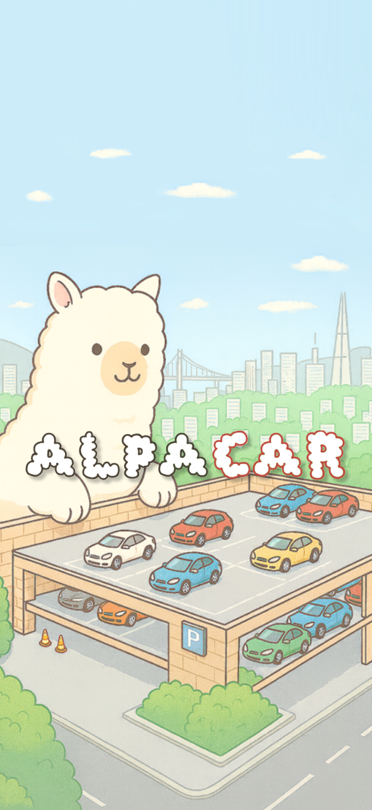

# 알파카(Alpacar)


## 프로젝트 소개
스마트 주차 관리 시스템

## 프로젝트 기간
2025.07.14 ~ 2025.08.19 (6주)

## 주요 기능
1. 입차 시 번호판 객체탐지 및 OCR 기반 차량번호 인식
2. 차량 모델 자동 조회
3. 최적 주차 구역 자동 추천
4. 앱 기반 사용자 안내
5. 배정받은 주차위치에 디스플레이로 차량번호 출력
6. 운전자 주차 능력 고려
7. 관리자 웹 모니터링
8. 웹 앱 사용자 목적지 전송 기능

## 기술 스택
### **Backend**
 


<br>


### **Frontend**


<br>


### Arduino


<br>


### Raspberry Pi


<br>


### **CI/CD**


### **Communication**
 
 
 
 


## 프로젝트 폴더 구조
### Arduino
<details>
  <summary>펼쳐보기</summary>
  ```plantext
  Arduino/
  ├── get_ocr_kor_ws/
  │   ├── get_ocr_kor_ws_update_0812.ino
  │   └── get_ocr_kor_ws.ino
  └── individual_lcd/
      └── individual_lcd.ino
  ```
</details>

### Backend
<details>
  <summary>펼쳐보기</summary>
  ```plantext
  backend/
  └── djangoApp/
      ├── djangoApp/
      │   ├── __init__.py
      │   ├── asgi.py
      │   ├── settings.py
      │   ├── urls.py
      │   └── wsgi.py
      ├── accounts/
      ├── Database/
      ├── events/
      ├── jetson/
      ├── parking/
      ├── staticfiles/
      ├── streamapp/
      ├── vehicles/
      ├── venv/
      ├── check_mappings.py
      ├── debug_encoding.py
      ├── Dockerfile
      ├── insert_data.py
      ├── manage.py
      ├── readme.md
      └── requirements.txt
  ```
</details>
### Frontend
frontend/
└── alpacar-vue/
    ├── public/
    ├── src/
    │   ├── api/
    │   ├── assets/
    │   ├── components/
    │   ├── composables/
    │   ├── data/
    │   ├── router/
    │   ├── stores/
    │   ├── types/
    │   ├── utils/
    │   ├── views/
    │   ├── App.vue
    │   └── main.ts
    ├── .vscode/
    ├── dev-dist/
    ├── node_modules/
    ├── .gitignore
    ├── Dockerfile
    ├── env.d.ts
    ├── index.html
    ├── MOBILE_DEBUG.md
    ├── package.json
    ├── package-lock.json
    ├── README.md
    ├── replace-alerts.js
    ├── tsconfig.app.json
    ├── tsconfig.json
    ├── tsconfig.node.json
    └── vite.config.ts

### jetson
<details>
  <summary>펼쳐보기</summary>
  ```plantext
  jetson/
  ├── best.pt
  ├── camera_tracking_obb.py
  ├── image_detector.py
  ├── local-websocket-server.py
  ├── output_obb.mp4
  ├── parking_check copy.py
  ├── parking_check.py
  ├── requirements.txt
  ├── sample.mp4
  ├── track.py
  ├── track-video.py
  ├── video_split.py
  ├── yolo_bytetrack_advanced.py
  └── yolo_simple.py
    ```
</details>

### Raspi
<details>
  <summary>펼쳐보기</summary>
  ```plantext
  Raspi/
  ├── autorun.service
  ├── best.pt
  ├── requirements.txt
  ├── service_start.md
  ├── stream_camera.py
  └── stream_ocr.py
  ```
</details>

## 팀원 소개
| 김민규 | 이재훈 | 이유니 | 김가현 | 백종석 | 양정은 |
|:--------------:|:--------------:|:--------------:|:--------------:|:--------------:|:--------------:|
| Backend & Embedded | AI & Infra | Embedded | Embedded | PM & Frontend | Frontend |

## 협업 방식
- git
  - 
  - 브랜치 이름 예시 : feature/AI or BE or FE or HW…/구현할 기능명
  - Mattermost 메신저 봇으로 커밋 시 자동으로 알림을 보내 코드 리뷰 진행

- JIRA
  - 작업 단위에 따라 `Epic-Story-Task` 분류
  - 매주 목표량을 설정하여 Sprint 진행
  - 업무의 할당량을 정하여 Story Point를 설정하고, In-Progress -> Done 순으로 작업

- 회의
  - 데일리 스크럼을 진행해 업무 진행 상황 및 당일 업무 공유

- Notion
  - 컨벤션, 트러블 슈팅, 개발 산출물 관리
  - 프로젝트용 자료 및 레퍼런스 관리

## 프로젝트 산출물
- [기획서](./docs/기획서.pdf)
- [기능명세서](./docs/기능명세서.pdf)
- [와이어프레임 & 목업](./docs/와이어_프레임%20&%20목업.pdf)
- [API명세서](./docs/API%20명세서.pdf)
- [ERD](./docs/ERD.pdf)
- [아키텍쳐](./docs/사용_기술_스택_아키텍처.pdf)
- [플로우차트](./docs/플로우_차트.pdf)
- [화면 명세서](./docs/화면_명세서.pdf)

## 화면 구성