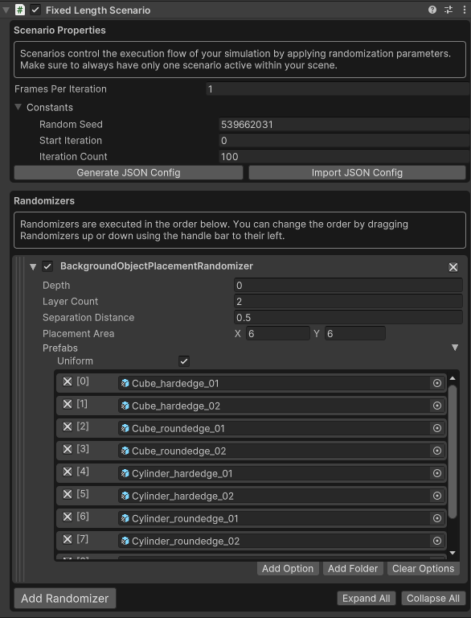

# Unity Perception 세팅 방법 정리

## 1. 프로젝트 세팅

1. 유니티 설치
    
    https://unity.com/kr/download
    
2. [2021.3.xxx](http://2021.3.xxx) 버전 에디터 설치
    
    
    
3. 프로젝트 생성
    
    
    
4. Package Manager 진입
    
    
    
5. 좌측 상단의 + 버튼을 눌러 Add Package by name 선택하고 패키기 다운로드
    

## 2. 데이터셋 생성

1. 예제 추가
    
    Perception의 Tutorial Files Import

    
    
2. 시뮬레이션 장면 생성
    - 프로젝트 탭에서 assert 폴더에 마우스 우클릭을 통해 scences 폴더 생성
    - 생성된 폴더에 마우스 우클릭을 통해 Create → Scenes 를 클릭
    - 새로 생긴 Scene을 더블클릭하여 진입
        
        
        
3. Main Camera 설정
    
    화면 좌측 상단의 Main Camera를 클릭하여 우측 Inspector 탭에서 아래와 같은 상태인지 확인
    
    
4. Peception 적용
    
    하단의 Add Component에서 Perception Cameara 추가
    
    
    
5. 경고 메시지 조치
    
    아래와 같은 오류와 경고가 나타난다.

    
    
    Edit → Project Setting → Editor 로 들어가서 Asynchronous Shader Compilation 해제
    
    
    
    asset Settings 에 HDRP 파일들 4개(폴더안에 1개 있음)에 Inspector 탭에서 Lit Shader Mode 를 Deferred Only 에서 Both 로 변경.

    
    
6. Ground Truth 라벨러 설정
    
    Assets 에서 마우스 우클릭 → Create → Perception → ID Lable Config 로 라벨러 생성
    
    

7. 카메라에 라벨러 추가
    
    Main Camera를 클릭하면 Camera Labelers 에 라벨링 방법을 추가할 수 있다. 여기서는 Bounding Box 2D Labeler만 추가한다.
    
    
    
8. 클래스 추가
    
    에셋들을 추가해서 라벨링을 처리한다
    
    아래는 임시 에셋들이다.
    
    
    
    모두 선택하고 Inspector 탭에서 Use Automatic Labeling for All Selected Items 를 클릭한 뒤, Use asset name을 클릭
    
    
    
    아래 처럼 창이 나타나고 All Label Configurations in Project에서 Add All Labels를 클릭하여 라벨러에게 클래스 추가
    
    
    
    라벨러에서 확인 가능
    
    
    
9. 랜더마이저 설정
    
    데이터셋마다 변화를 주기위한 랜더마이저 설정
    
    화면 좌측 Hierachy 탭에서 + 버튼 또는 마우스 우클릭으로 Create Empty 로 GameObject 생성
    
    이름은 Simulation Scenario 라고 명명
    
    마우스로 선택하고 Inspector 탭에서 Add Component 에서 Fixed Length Scenario 추가
    
    
    
    Add Randomizer 에서 BackGroundObjectPlacementRandomizer 선택
    
    Add Folder 클릭해서 배경으로 활용할 에셋들을 추가
    
    Depth = 0, Layer Count = 2, Seperation Distance = 0.5, Placement Area = (6,6) 지정
    
    TextureRandomizer, HueOffsetRandomier, RotationRandomizer 등을 추가해서 추가적인 변수 생성
    
    이후 ForeGroundObjectPlacementRandomizer 도 같은 방식으로 추가 후 Depth = -3, Seperation Distance = 1.5, Placement Area = (5, 5) 로 지정
    
    아래와 같은 방식으로 사용 가능
    
    