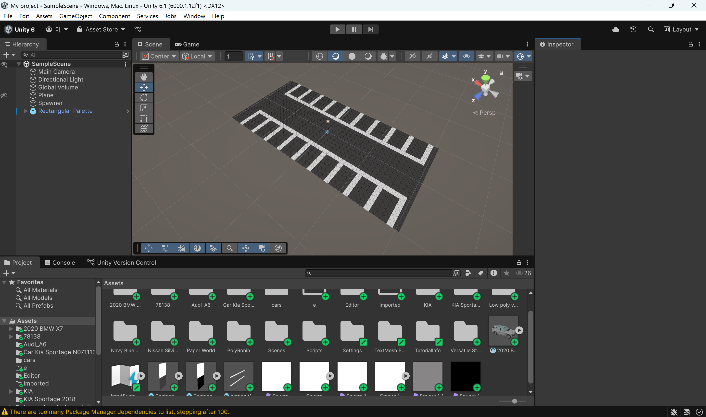

# 모델 개발 과정
## 차량 추적 모델
주차장의 자세한 정보를 수집하기 위한 모델입니다.
차량의 동선, 주차 여부 및 상태를 실시간으로 추적합니다.
- 사용된 모델 : YOLO11s-OBB
- 학습 데이터셋 : 2만 건 (가상 주차장 1만 건 + Perception 1만 건)
- 에포크 수 : 150

탑뷰관점 + 차량 데이터셋이 희소합니다. 그렇기에 실제 데이터셋을 생성하여 이 문제를 해결합니다. 처음에는 직접 주차장을 조성해서 차량 에셋들을 생성했습니다. 
.gif>)
학습한 모델은 차량을 인식하는 경향성을 나타내었지만 노이즈에 취약한 문제가 있었습니다. 그래서 Perception 을 활용하여 대량의 노이즈에 내구성을 띄는 데이터셋을 추가해서 총 2만 건의 데이터로 학습하게 되었습니다.

## 자율 주차 모델
강화학습 기반 모델을 통해 주차를 학습시켜 사용자의 주차 행동을 모방하기 위한 모델입니다. 쉬운 주차장에서 학습한 모델과 어려운 환경에서 학습한 모델을 초보와 숙련자에 대응시켜 운전 데이터셋을 생성하게 됩니다. 생성된 데이터셋은 차량 입차 시 마다 주차환경정보를 바탕으로 적절한 주차 공간을 배정하는데 활용됩니다. 
- 학습 환경 : gymnasium, stable-baselines3
- 사용된 모델 : SAC
- 학습 스텝 : 2,000,000 회
  

